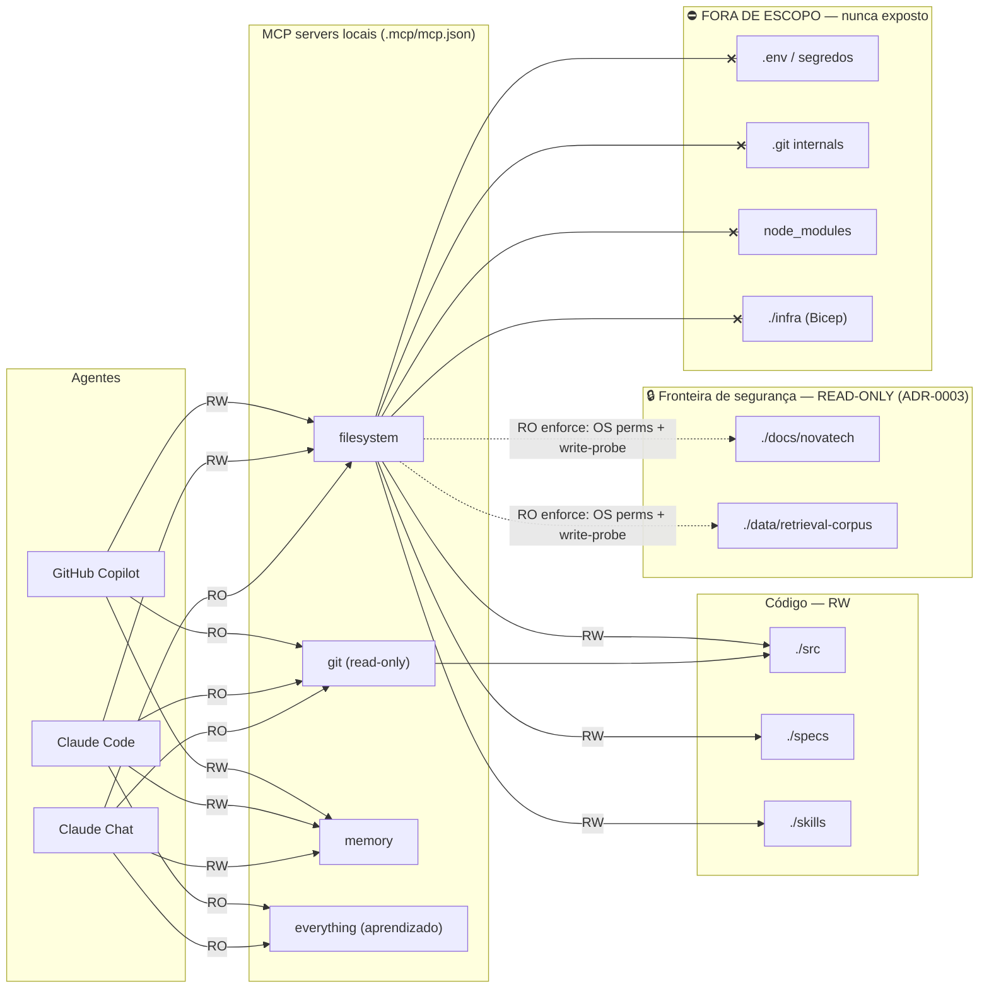

# Arquitetura de MCP — NovaTech Assistant (servers locais)

**Projeto:** NovaTech Assistant
**Papel:** Tech Lead
**Ferramenta de autoria:** Claude (chat)
**Data:** 2026-06-15
**Escopo:** Exercício 2.2 — Prompt 1
**Documento vivo — versão:** 1.0 · versionado em `.mcp/` no Git

> **Regra de leitura:** este documento é prescritivo. `DEVE` = obrigatório e verificável. `NÃO DEVE` = proibido, bloqueia merge. `QUANDO FALHAR` = comportamento esperado em degradação. Cada seção termina com **Critérios verificáveis** — checks objetivos que dois revisores avaliariam igual.

---

## 1. Objetivo e escopo

### 1.1 Objetivo

Definir a arquitetura de MCP (Model Context Protocol) do NovaTech Assistant tratando os servers como **infraestrutura gerenciada** — versionada, com permissões mínimas e observável — e **não** como configuração ad-hoc por máquina de desenvolvedor.

O MCP é a camada padronizada pela qual os agentes (Copilot, Claude Code, Claude Chat) acessam o repositório, a documentação de negócio da NovaTech e o corpus de busca. Cada server expõe três primitivas: **Tools** (ações), **Resources** (dados read-only) e **Prompts** (templates). Esta arquitetura decide quais servers são autorizados, o que cada um expõe e quem consome o quê.

### 1.2 Por que tudo é local e gratuito

- **Custo e dependência externa:** Esta fase é de estruturação. Servers locais (*reference servers* rodando via `npx`/`uvx`) eliminam custo recorrente e a dependência de credenciais de serviços pagos. O time não fica bloqueado por billing, rate limit ou indisponibilidade de SaaS.
- **Superfície de ataque reduzida:** Nenhum dado de negócio da NovaTech sai da máquina. Sem tráfego para nuvem, sem segredo de API de terceiros, sem risco de exfiltração via integração externa.
- **Health check executável de verdade:** Como os processos sobem localmente, "monitorar" e "health check" são operações reais (subir o processo, fazer handshake, listar tools), não diagramas teóricos.

**NÃO DEVE** ser usado nesta fase como MCP server: GitHub, Azure AI Search, Azure OpenAI, Confluence, Azure DevOps ou qualquer serviço externo/pago. Esses são consumidos pela aplicação em runtime (camada de produto), **não** pela camada de ferramentas dos agentes nesta fase.

### 1.3 Servers autorizados (escopo fechado)

| # | Server | Pacote/binário | Papel na arquitetura |
|---|--------|----------------|----------------------|
| 1 | `filesystem` | `@modelcontextprotocol/server-filesystem` (npx) | Acesso a código (rw) e fontes de negócio (ro) |
| 2 | `git` | `mcp-server-git` (uvx) | Histórico, diff e branches do repo local — leitura |
| 3 | `memory` | `@modelcontextprotocol/server-memory` (npx) | Grafo persistente de decisões e linguagem ubíqua |
| 4 | `everything` | `@modelcontextprotocol/server-everything` (npx) | Exploração das primitivas de MCP (aprendizado) |

**Critérios verificáveis (§1):**
- [ ] O `.mcp/mcp.json` contém **exatamente** estes 4 servers — nenhum a mais.
- [ ] Nenhum server aponta para endpoint de rede externo (todos `command` = `npx`/`uvx` local).
- [ ] O documento está versionado no Git (não é config de máquina local não-rastreada).

---

## 2. Inventário dos MCP servers (Tools / Resources / Prompts)

### 2.1 `filesystem`

| Primitiva | O que expõe |
|-----------|-------------|
| **Tools** | `read_file`, `read_multiple_files`, `list_directory`, `directory_tree`, `search_files`, `get_file_info` (leitura); `write_file`, `edit_file`, `create_directory`, `move_file` (escrita) |
| **Resources** | Árvore de arquivos das raízes permitidas |
| **Prompts** | — |

> **Limitação técnica crítica (honesta):** o reference server `@modelcontextprotocol/server-filesystem` expõe **o conjunto completo de tools** (leitura **e** escrita) sobre **toda** raiz passada em `args`. Ele **não** tem flag de "read-only por pasta". Logo, a distinção RO/RW de `docs/novatech` e `data/retrieval-corpus` **NÃO é garantida pela config do server** — precisa de defesa em profundidade (ver §4.1). Esta é a decisão de arquitetura mais importante deste documento.

### 2.2 `git`

| Primitiva | O que expõe |
|-----------|-------------|
| **Tools** | `git_status`, `git_log`, `git_diff`, `git_diff_unstaged`, `git_diff_staged`, `git_show`, `git_branch` (leitura). Tools de escrita (`git_add`, `git_commit`, `git_create_branch`) **NÃO DEVEM** ser habilitadas nesta fase. |
| **Resources** | Histórico de commits do repositório local |
| **Prompts** | — |

### 2.3 `memory`

| Primitiva | O que expõe |
|-----------|-------------|
| **Tools** | `create_entities`, `create_relations`, `add_observations`, `read_graph`, `search_nodes`, `open_nodes`, `delete_*` |
| **Resources** | Grafo de conhecimento persistido (decisões arquiteturais, linguagem ubíqua) |
| **Prompts** | — |

**NÃO DEVE** conter dados sensíveis (segredos, PII de clientes NovaTech). O grafo é metadado de decisão, não cópia de documento de negócio.

### 2.4 `everything`

| Primitiva | O que expõe |
|-----------|-------------|
| **Tools** | Tools de demonstração (`echo`, `add`, `longRunningOperation`, `sampleLLM`, etc.) |
| **Resources** | Resources de exemplo |
| **Prompts** | Prompts de exemplo |

Server **exclusivamente de aprendizado** das primitivas MCP. **NÃO DEVE** receber dados do projeto. É candidato a remoção quando o time dominar MCP (ver §5 — critério de desativação).

**Critérios verificáveis (§2):**
- [ ] Para cada server, as tools de escrita estão explicitamente listadas como habilitadas ou proibidas.
- [ ] `git` está documentado como leitura; tools de escrita marcadas como NÃO DEVE.
- [ ] `everything` está marcado como sem dados do projeto.

---

## 3. Matriz de consumo por agente/papel

Quem consome o quê, com qual acesso. RO = somente leitura efetiva (do ponto de vista do agente); RW = leitura e escrita.

| Agente | `filesystem` (src/specs/skills) | `filesystem` (docs/novatech, data/retrieval-corpus) | `git` | `memory` | `everything` |
|--------|:---:|:---:|:---:|:---:|:---:|
| **GitHub Copilot** (gera código no IDE) | RW | RO | RO | RW | — |
| **Claude Code** (refatora/automação) | RW | RO | RO | RW | RO |
| **Claude Chat** (design/arquitetura) | RO | RO | RO | RW | RO |

Regras de leitura da matriz:
- **Copilot** escreve código (`src/`, specs, skills) e registra decisões no `memory`. **NÃO DEVE** escrever em `docs/novatech` nem `data/retrieval-corpus`.
- **Claude Chat** atua em design: lê tudo, escreve apenas no grafo de decisões (`memory`). **NÃO DEVE** ter RW em `src/` — design não comita código diretamente.
- **Toda** célula sob `docs/novatech` e `data/retrieval-corpus` é **RO sem exceção** (ADR-0003: documentos de negócio são fonte de verdade; agente não os altera).
- Nenhum agente tem RW em `git` nesta fase (commits são ação humana revisada).



**Critérios verificáveis (§3):**
- [ ] Cada par (agente × server) tem RO ou RW explícito — sem célula ambígua.
- [ ] `docs/novatech` e `data/retrieval-corpus` aparecem como RO para **todos** os agentes.
- [ ] O diagrama mostra a fronteira de segurança e a zona "fora de escopo" (`.env`, `.git`, `node_modules`, `infra`).

---

## 4. Permissões mínimas por server (least privilege)

### 4.1 `filesystem` — o ponto mais sensível

**Raízes concedidas (e somente estas):**
```
./src
./specs
./skills
./docs/novatech
./data/retrieval-corpus
```

**Delta de least privilege vs. o `mcp.example.json` do starter:** o exemplo passa `./docs` e `./data` (pastas inteiras). Isto **DEVE** ser estreitado para `./docs/novatech` e `./data/retrieval-corpus` — as subpastas exatas que o agente precisa. `docs/adr`, `docs/runbooks`, `docs/onboarding.md` não são necessários ao loop de geração e **NÃO DEVEM** entrar no escopo.

**O que NÃO DEVE estar nas raízes (justificativa):**

| Caminho excluído | Justificativa de least privilege |
|------------------|----------------------------------|
| raiz do repo `.` | Daria acesso a `.env`, `.git`, `node_modules`, `infra`, `package.json` — escopo amplíssimo, expõe segredos. |
| `.env` / `*.env` | Segredos. Vazamento direto se o agente os ler/colar em log ou resposta. |
| `.git/` | Internals do Git devem ser acessados via server `git` (read-only), não como arquivos editáveis. |
| `node_modules/` | Volume enorme, ruído de contexto, e código de terceiros não deve ser editado pelo agente. |
| `infra/` (Bicep) | Mudança de IaC é alto impacto; fica fora do loop autônomo de geração nesta fase. |

**Enforcement do RO em `docs/novatech` e `data/retrieval-corpus` (defesa em profundidade):**
Como o reference server expõe `write_file`/`edit_file` em toda raiz (§2.1), o RO é garantido por **três camadas**, não pela config:

1. **OS-level (garantia dura):** `chmod -R a-w docs/novatech data/retrieval-corpus` em ambiente de dev; *read-only bind mount* em container/CI. Mesmo que o agente chame `write_file`, o SO rejeita com `EACCES`.
2. **Health-check write-probe (detecção):** o health check **DEVE** tentar escrever um arquivo temporário em cada pasta RO e **assertar que falha**. Se a escrita **suceder**, o server é reportado `DEGRADED` (a garantia de RO está quebrada).
3. **Política/AGENTS.md (intenção):** regra prescritiva — agentes `NÃO DEVEM` chamar tools de escrita contra `docs/novatech` e `data/retrieval-corpus`.

### 4.2 `git`

- **Permissão mínima:** somente tools de leitura (`git_log`, `git_diff`, `git_status`, `git_show`, `git_branch`).
- **Justificativa:** o valor é dar contexto histórico ao agente (o que mudou, por quê). Commit/branch são decisões humanas revisadas — escrita via agente burlaria o validation gate de PR.
- `--repository .` aponta para o repo local; **NÃO DEVE** apontar para outro repositório.

### 4.3 `memory`

- **Permissão mínima:** RW no grafo, mas **escopo de conteúdo restrito** a decisões de arquitetura e linguagem ubíqua.
- **Justificativa:** o grafo é o único store com escrita "livre" porque é metadado de baixo risco. O risco é poluição/segredo, mitigado pela regra de conteúdo (§2.3), não por permissão de I/O.

### 4.4 `everything`

- **Permissão mínima:** acesso default do reference server, **sem** nenhuma raiz de dados do projeto.
- **Justificativa:** uso é aprendizado das primitivas; não precisa de nada do NovaTech.

### 4.5 Configuração de referência implícita (a ser escrita no Prompt 3)

Esta arquitetura implica o seguinte `.mcp/mcp.json` (o arquivo será efetivamente preenchido no Prompt 3 a partir do `mcp.example.json`, aplicando o estreitamento de escopo acima):

```jsonc
{
  "mcpServers": {
    "filesystem": {
      "command": "npx",
      "args": ["-y", "@modelcontextprotocol/server-filesystem",
               "./src", "./specs", "./skills",
               "./docs/novatech", "./data/retrieval-corpus"]
    },
    "git":     { "command": "uvx", "args": ["mcp-server-git", "--repository", "."] },
    "memory":  { "command": "npx", "args": ["-y", "@modelcontextprotocol/server-memory"] },
    "everything": { "command": "npx", "args": ["-y", "@modelcontextprotocol/server-everything"] }
  }
}
```

**Critérios verificáveis (§4):**
- [ ] O `filesystem` recebe `docs/novatech`/`data/retrieval-corpus` (subpastas), **não** `docs`/`data` inteiros.
- [ ] `.env`, `.git`, `node_modules`, `infra` **não** aparecem em nenhuma raiz do `filesystem`.
- [ ] Existe enforcement de RO em pelo menos uma camada dura (OS perms ou mount) + write-probe no health check.
- [ ] Nenhum escopo amplo (pasta-pai) sem justificativa explícita escrita.

---

## 5. Política de aprovação para adicionar um novo server local

Equilíbrio: **agilidade com segurança**. Nem burocracia que trava o time, nem "qualquer um adiciona qualquer server". O nível de revisão escala com o risco.

### 5.1 Classificação de risco do server proposto

| Nível | Definição | Exemplos |
|-------|-----------|----------|
| **Baixo** | Read-only, sem dados sensíveis, sem rede | `everything`, `git` (read-only), um server de leitura de docs |
| **Médio** | Escrita em pastas de código já no escopo, ou leitura de pasta nova | `filesystem` ampliando raiz, `memory` |
| **Alto** | Escrita em pastas novas, acesso a rede, ou qualquer caminho que possa conter segredos | server que toca `.env`, `infra/`, ou faz chamada externa |

### 5.2 Fluxo de aprovação por nível

| Nível | Quem revisa | SLA | Gate obrigatório |
|-------|-------------|-----|------------------|
| Baixo | 1 revisor (qualquer dev sênior do time) | mesmo dia | Passar no health check |
| Médio | Tech Lead | até 1 dia útil | Health check + checklist de segurança §5.3 |
| Alto | Tech Lead + 1 (segurança/owner do repo) | revisão dedicada | Checklist completo + fase piloto §5.4 + ADR |

### 5.3 Checklist mínimo (todo PR que altera `.mcp/mcp.json`)

**Segurança:**
- [ ] Escopo de pastas é o **mínimo suficiente** (subpasta, não pasta-pai), com justificativa escrita.
- [ ] RO vs RW declarado e correto; fontes de negócio permanecem RO.
- [ ] Nenhum caminho com segredos (`.env`, `*.pem`, `*.key`, `.git`) no escopo.
- [ ] Server roda **local** (sem endpoint externo/pago).

**Valor:**
- [ ] Há uma necessidade concreta do projeto que o server atende (linkar a spec/task/ADR).
- [ ] A capacidade não é redundante com um server já existente.

**Observabilidade (pré-requisito de uso):**
- [ ] O server é coberto pelo health check e **passou** com saída real anexada ao PR.

### 5.4 Fase piloto e promoção

- Server `Alto` (ou novo padrão) entra primeiro como **piloto**: usado por 1 agente, por 1 desenvolvedor, por ≥ 3 dias úteis, com health check no CI.
- **Critério de promoção** para uso amplo: zero incidentes de escopo no piloto + health check verde em todas as execuções + checklist §5.3 fechado.

### 5.5 Critério de desativação/remoção

Um server **DEVE** ser removido do `.mcp/mcp.json` quando: (a) ficou sem consumidor por 30 dias; (b) falha no health check de forma recorrente sem dono; ou (c) cumpriu seu propósito (ex.: `everything`, quando o time dominar MCP).

**Critérios verificáveis (§5):**
- [ ] Existem 3 níveis de risco com revisor e SLA distintos (não um fluxo único).
- [ ] O checklist cobre segurança **e** valor **e** observabilidade.
- [ ] Há critério explícito de piloto→promoção e de remoção.

---

## 6. Monitoramento

Como saber que um server parou de responder ou perdeu acesso a uma pasta. Isto é executável de verdade (servers são locais) — implementado pelo health check (Prompts 3–4).

### 6.1 Sinais monitorados por server

| Server | Verificação | Falha = |
|--------|-------------|---------|
| `filesystem` | Handshake MCP + `list_directory` em cada raiz RW + **read-probe** em `docs/novatech` e `data/retrieval-corpus` + **write-probe** que DEVE falhar nas RO | Pasta inacessível, ou escrita possível em pasta RO |
| `git` | Handshake + `git_log` retorna ≥ 1 commit | Sem repo / sem commit inicial |
| `memory` | Handshake + `read_graph` responde | Processo não sobe / grafo corrompido |
| `everything` | Handshake + `tools/list` retorna lista não-vazia | Processo não sobe |

### 6.2 Estados e semântica

- **OK** — handshake + todas as verificações passam.
- **DEGRADED** — server sobe, mas alguma verificação falha (ex.: `filesystem` perdeu uma raiz, ou escrita possível em pasta RO, ou `git` sem histórico). Capacidade reduzida; agente DEVE operar em modo degradado (§8).
- **DOWN** — server não faz handshake / processo não inicia.

### 6.3 Cadência

- **Local, sob demanda:** `npx tsx scripts/mcp-health-check.ts` antes de uma sessão de geração relevante.
- **CI:** o health check roda no pipeline em todo PR que toca `.mcp/`, `docs/novatech/` ou `data/retrieval-corpus/`. Exit code != 0 bloqueia o merge.
- **Saída dupla:** tabela no terminal (humano) + JSON (CI/automação).

**Critérios verificáveis (§6):**
- [ ] Cada server tem uma verificação concreta definida (não "checar se está ok").
- [ ] O `filesystem` é monitorado por read-probe E write-probe (RO).
- [ ] Estados OK/DEGRADED/DOWN têm definição objetiva e exit codes mapeados.

---

## 7. Versionamento e compatibilidade

Como mudar o escopo de um server sem quebrar fluxos existentes.

### 7.1 Regras

- O `.mcp/mcp.json` **DEVE** ser versionado no Git. Toda mudança passa por PR (ver §5).
- Versões dos pacotes de server **DEVEM** ser fixadas (pinning) — ex.: `@modelcontextprotocol/server-filesystem@<versão>` — para builds reprodutíveis. `NÃO DEVE` usar `latest` implícito em produção do time.
- Mudança de escopo **só amplia com justificativa**; **estreitar** escopo é sempre permitido (mais seguro).

### 7.2 Mudança que pode quebrar fluxo

Toda alteração que **remove ou estreita** uma raiz é **breaking** para quem dependia dela. Procedimento:

1. **Anunciar** no PR quais agentes/fluxos consumiam a raiz removida (consultar a matriz §3).
2. **Rodar o health check** no estado novo — ele deve passar; se um fluxo esperado quebra, o write/read-probe acusa.
3. **Migração:** se um agente perdeu acesso necessário, a mudança DEVE prover o caminho alternativo antes do merge (ex.: mover doc para uma raiz ainda acessível).
4. **Registrar** a mudança de escopo no `prompt-changelog.md`/ADR e no grafo `memory`.

### 7.3 Compatibilidade

- A matriz de consumo (§3) é o **contrato**. Mudar escopo **DEVE** atualizar a matriz no mesmo PR. Matriz e `mcp.json` divergentes = red flag de revisão.

**Critérios verificáveis (§7):**
- [ ] Versões de pacote estão pinadas no `mcp.json` ou em doc de setup.
- [ ] Há procedimento explícito para mudança breaking (estreitar/remover raiz).
- [ ] A matriz §3 é declarada como contrato e atualizada junto com o `mcp.json`.

---

## 8. Plano de contingência (degradar com aviso, nunca alucinar)

Princípio: **agente degradado com aviso > agente que inventa**. Proibido "se cair, para tudo" e proibido continuar como se o dado existisse.

| Server indisponível | O que o agente PERDE | Modo degradado — o agente DEVE | O agente NÃO DEVE |
|---------------------|----------------------|-------------------------------|-------------------|
| `filesystem` perde `docs/novatech` | Fonte de negócio (políticas, SLA, FAQ) | Avisar: *"sem acesso à base de negócio; não vou inventar política/SLA"*; pedir o dado ao humano; seguir só em tarefas que não dependem da fonte | Responder regra de negócio "de memória" |
| `filesystem` perde `data/retrieval-corpus` | "Recuperação" de chunks (RAG) | Avisar que o RAG está indisponível; responder só com o que está no contexto explícito; marcar a resposta como sem fonte recuperada | Fabricar `source_document` |
| `git` não responde | Histórico/diff/contexto de mudança | Operar sem contexto histórico; declarar que não consegue justificar mudanças por histórico | Afirmar o que mudou sem poder verificar |
| `memory` cai | Decisões e linguagem ubíqua persistidas | Operar com contexto da sessão atual; **não** persistir decisões até voltar; avisar que pode repetir decisão já tomada | Tratar como se não houvesse histórico de decisão e sobrescrever convenções |
| Mudança de escopo no `mcp.json` quebra um fluxo | Acesso que existia antes | Health check acusa (DEGRADED); reverter o PR ou prover caminho alternativo (§7.2) antes de prosseguir | Forçar geração ignorando o acesso perdido |

Para **cada** cenário (modelo executável por time pequeno):

1. **Detecção** — health check reporta `DEGRADED`/`DOWN`; o agente percebe via tool error (`EACCES`, server não responde).
2. **Ação imediata (0–15 min)** — rodar `mcp-health-check.ts`; identificar server e causa (não inicia / timeout / pasta inacessível / escopo divergente); aplicar o modo degradado da tabela.
3. **Modo degradado** — conforme tabela: avisa, reduz capacidade, **nunca alucina**; o que não depende do server continua funcionando.
4. **Escalonamento** — dev que detectou aciona o **Tech Lead**; mudança de escopo/segurança envolve o owner do repo. Sem dono em 1 dia útil → server marcado para remoção (§5.5).
5. **Critério de retorno ao normal** — health check volta a `OK` (handshake + todas as verificações, incluindo write-probe RO) em duas execuções consecutivas.

**Critérios verificáveis (§8):**
- [ ] Cada um dos 5 cenários tem detecção, ação 0–15 min, modo degradado, escalonamento e retorno.
- [ ] Em todo cenário o agente **avisa** e **não inventa** (sem `source_document` fabricado).
- [ ] Nenhum cenário usa "para tudo" como resposta.

---

## 9. Riscos e mitigações (setup local)

| # | Risco (específico ao setup LOCAL) | Severidade | Mitigação prescritiva |
|---|-----------------------------------|:---------:|----------------------|
| R1 | **`filesystem` com escopo amplo** (raiz `.` ou `docs`/`data` inteiros) expõe `.env`, `.git`, `infra`, segredos. | Alta | Estreitar raízes às subpastas exatas (§4.1); health check **DEVE** falhar se uma raiz proibida aparecer no `mcp.json`. |
| R2 | **Escrita habilitada nas fontes de negócio** — o reference filesystem expõe `write_file` em toda raiz; agente pode alterar `docs/novatech` sem revisão. | Alta | Defesa em profundidade RO (§4.1): OS perms/mount read-only + write-probe no health check + regra no AGENTS.md. |
| R3 | **Vazamento de segredo via contexto** — agente lê um arquivo com credencial e o ecoa em resposta/log/commit. | Alta | `.env` e `*.key`/`*.pem` fora de toda raiz (§4.1); regra: agente `NÃO DEVE` colar conteúdo de arquivo de config em resposta. |
| R4 | **Poluição/segredo no `memory`** — grafo persistente vira lixeira ou guarda dado sensível. | Média | Regra de conteúdo (§2.3): só decisões e linguagem ubíqua; `NÃO DEVE` conter PII/segredo; revisão periódica do grafo. |
| R5 | **Supply chain via `npx -y`/`uvx`** — `-y` instala o pacote sem prompt; pacote comprometido roda na máquina do dev. | Média | Pinar versão dos servers (§7.1); usar apenas pacotes oficiais `@modelcontextprotocol/*` / `mcp-server-git`; revisar mudança de pacote no PR. |
| R6 | **`git init` ausente** — sem commit inicial, o server `git` não tem histórico e o agente opera "cego" achando que está OK. | Baixa | Pré-requisito do README (`git add -A && git commit`); health check `git` exige ≥ 1 commit, senão `DEGRADED`. |
| R7 | **Config divergente entre devs** — `mcp.json` editado localmente e não versionado gera comportamento diferente por máquina. | Média | `.mcp/mcp.json` versionado e único (§7); divergência local é proibida; CI valida o arquivo no PR. |

**Critérios verificáveis (§9):**
- [ ] ≥ 5 riscos, todos específicos ao setup local (não genéricos de nuvem).
- [ ] Cada risco tem severidade e mitigação **acionável** (não "ter cuidado").
- [ ] R1 e R2 (escopo amplo / escrita em fonte de negócio) estão cobertos.

---

## Apêndice — Rastreabilidade aos critérios de avaliação 2.2

| Critério da avaliação | Onde é atendido |
|-----------------------|-----------------|
| MCP como infraestrutura gerenciada (versionamento, monitoramento, política) | §1.1, §5, §6, §7 |
| Diagrama de conexões (quem consome o quê, com permissões) | §3 (matriz + Mermaid) |
| Política de aprovação equilibrada (agilidade + segurança) | §5 (níveis de risco, SLA, piloto) |
| Least privilege concreto e justificado | §4 (raízes estreitadas, tabela de exclusões) |
| Monitoramento (server caiu / perdeu pasta) | §6 (verificações, estados, write-probe) |
| Versionamento sem quebrar fluxos | §7 (pinning, mudança breaking, matriz como contrato) |
| Plano de contingência (degradar, não alucinar) | §8 (5 cenários executáveis) |
| Riscos do setup local + mitigação | §9 (7 riscos) |

> **Próximos prompts da 2.2:** Prompt 2 refina o diagrama e a matriz de permissões; Prompt 3 preenche o `.mcp/mcp.json` real e gera o health check (Copilot) **com saída de execução real**; Prompts 5–6 entregam contingência e política como artefatos dedicados; Prompt 7 consolida o relatório final.
