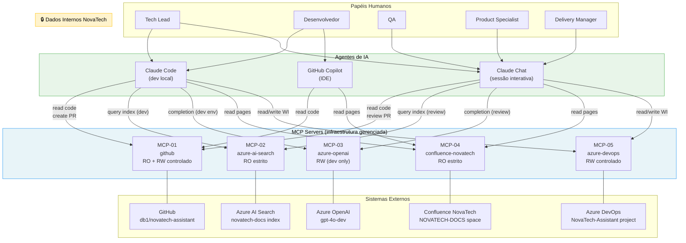

# Arquitetura de MCP — NovaTech Assistant

> **Papel:** Tech Lead  
> **Exercício:** 2.2 — Arquitetura de MCP para o projeto  
> **Repositório fictício:** `db1/novatech-assistant`  
> **Versão do documento:** 1.0  
> **Data:** 2026-06-09

---

## 1. Objetivo e Escopo

### Objetivo

Este documento define a arquitetura de MCP (Model Context Protocol) do projeto NovaTech Assistant. MCP servers são tratados como **infraestrutura gerenciada** — não como configuração ad-hoc — e por isso passam pelos mesmos controles de versionamento, monitoramento e aprovação que qualquer outro componente de infraestrutura do projeto.

### Escopo

- Cobre todos os MCP servers autorizados para uso no repositório `db1/novatech-assistant`.
- Define quem pode consumir cada server, com que permissões, e sob quais condições.
- Estabelece o processo de aprovação para adição de novos servers.
- Define como o time responde à indisponibilidade de um server.

### O que está fora do escopo

- Configurações locais de MCP de cada desenvolvedor fora do contexto do projeto.
- MCP servers de outros projetos da DB1 (não há compartilhamento de configuração entre repositórios).

### Critério de aderência verificável

O arquivo `.mcp/mcp.json` no repositório DEVE listar apenas os servers definidos neste documento. Qualquer server presente no arquivo que não esteja neste documento constitui violação de política.

---

## 2. Inventário de MCP Servers

Os 5 servers autorizados para o projeto são:

| ID | Nome | Tipo | Acesso | Finalidade |
|----|------|------|--------|------------|
| MCP-01 | `github` | Público (`@modelcontextprotocol/server-github`) | RO + RW controlado | Leitura de código, criação de PRs, revisão de diffs |
| MCP-02 | `azure-ai-search` | Customizado (a construir) | RO | Consulta ao índice vetorial de documentos NovaTech |
| MCP-03 | `azure-openai` | Customizado (a construir) | RW | Chamadas à Completion API do GPT-4o |
| MCP-04 | `confluence-novatech` | Customizado (a construir) | RO estrito | Leitura de páginas da documentação de negócio da NovaTech |
| MCP-05 | `azure-devops` | Público (`@modelcontextprotocol/server-azure-devops`) | RW controlado | Leitura e escrita de work items no board do projeto |

### Critério de aderência verificável

- Cada server DEVE ter um ID único no formato `MCP-NN`.
- Cada server DEVE ter seu tipo (público ou customizado) documentado.
- Servers customizados DEVEM ter seu código-fonte sob `/infra/mcp-servers/` no repositório.

---

## 3. Matriz de Consumo por Agente/Papel

A tabela abaixo define quem consome cada server e em qual contexto. "Agente" refere-se à ferramenta de IA que realiza a chamada MCP; "papel" refere-se ao humano que opera a ferramenta.

| MCP Server | Agente | Papel humano | Contexto de uso |
|------------|--------|--------------|-----------------|
| MCP-01 `github` | Claude Code, GitHub Copilot | Tech Lead, Desenvolvedor | Leitura de código para geração de artefatos; criação de PRs a partir de specs |
| MCP-01 `github` | Claude Chat | Tech Lead | Revisão de PRs, leitura de histórico de commits |
| MCP-02 `azure-ai-search` | Claude Code | Desenvolvedor | Validação de queries durante desenvolvimento de `src/services/search.ts` |
| MCP-02 `azure-ai-search` | Claude Chat | Tech Lead, QA | Verificação de cobertura do índice durante review e testes |
| MCP-03 `azure-openai` | Claude Code | Desenvolvedor | Testes de integração do `src/services/completion.ts` |
| MCP-03 `azure-openai` | Claude Chat | Tech Lead, QA | Validação de outputs do assistente com dados reais |
| MCP-04 `confluence-novatech` | Claude Chat, Claude Code | Todos os papéis | Leitura de documentação de negócio para gerar artefatos coerentes com domínio |
| MCP-05 `azure-devops` | Claude Chat, Claude Code | Tech Lead, Delivery Manager | Criação e atualização de work items a partir de specs e tasks geradas |

### Regras de consumo

- Claude Code DEVE consumir MCP-03 somente com chave de API de ambiente `dev` — nunca produção.
- Claude Chat NÃO DEVE ter acesso de escrita ao MCP-02 (índice é imutável via agente).
- MCP-04 NÃO DEVE ser consumido por automações de CI — somente por sessões interativas de agentes.

### Critério de aderência verificável

A configuração `.mcp/mcp.json` DEVE definir perfis por agente (`copilot`, `claude-code`, `claude-chat`) com escopos distintos para cada server.

---

## 4. Permissões Mínimas por Server

### MCP-01 — GitHub

| Escopo OAuth | Justificativa |
|-------------|---------------|
| `repo:read` | Leitura de código e histórico |
| `pull_requests:write` | Criação de PRs a partir de specs |
| `issues:read` | Leitura de issues para contexto |

**NÃO DEVE ter:** `admin:repo`, `delete_repo`, `packages:write`, acesso a outros repositórios além de `db1/novatech-assistant`.

### MCP-02 — Azure AI Search

| Permissão | Escopo |
|-----------|--------|
| `Search Index Reader` (RBAC) | Consulta ao índice `novatech-docs` |

**NÃO DEVE ter:** `Search Index Contributor`, `Search Service Contributor`. Agente não pode reindexar ou modificar o índice.

### MCP-03 — Azure OpenAI

| Permissão | Escopo |
|-----------|--------|
| `Cognitive Services OpenAI User` (RBAC) | Chamadas à deployment `gpt-4o-dev` |

**NÃO DEVE ter:** acesso à deployment de produção `gpt-4o-prod`. O MCP server DEVE resolver a deployment via variável de ambiente `AZURE_OPENAI_DEPLOYMENT`, configurada por ambiente.

### MCP-04 — Confluence NovaTech

| Permissão | Escopo |
|-----------|--------|
| `space:read` no espaço `NOVATECH-DOCS` | Leitura de páginas |

**NÃO DEVE ter:** permissões de escrita em nenhum espaço do Confluence. A service account usada DEVE ser exclusiva deste projeto (não compartilhada com outros sistemas).

### MCP-05 — Azure DevOps

| Permissão | Escopo |
|-----------|--------|
| `Work Items: Read & Write` no projeto `NovaTech-Assistant` | Criação e atualização de tasks |
| `Build: Read` | Leitura de status de pipelines |

**NÃO DEVE ter:** `Project Administrator`, permissões em outros projetos Azure DevOps, acesso a pipelines de produção.

### Critério de aderência verificável

Revisão trimestral de permissões concedidas nas respectivas plataformas contra as permissões documentadas aqui. Qualquer permissão adicional detectada DEVE ser removida e reportada como incidente de segurança menor.

---

## 5. Política de Aprovação para Novo MCP Server

### Princípio

Adicionar um MCP server ao projeto é equivalente a adicionar uma dependência de infraestrutura. O processo equilibra velocidade (time pequeno, iteração rápida) com segurança (não expor dados sensíveis, não conceder acesso desnecessário).

### Fluxo de aprovação

```
Proposta (qualquer membro) → Tech Lead avalia em 1 dia útil → 
  [Baixo risco] → Aprovação direta do TL + PR com .mcp/mcp.json atualizado
  [Médio risco] → TL + 1 Dev Sênior revisam → aprovação em até 3 dias úteis
  [Alto risco]  → TL + consulta à equipe de segurança da DB1 → aprovação em até 5 dias úteis
```

### Classificação de risco

| Nível | Critério |
|-------|----------|
| **Baixo** | Server RO, dados não-sensíveis, servidor público e auditado, sem escrita em sistemas de registro |
| **Médio** | Server com acesso RW, ou dados internos da NovaTech, ou sem histórico público auditado |
| **Alto** | Server com acesso a dados de clientes, credenciais, sistemas financeiros, ou qualquer escrita fora do repositório e board do projeto |

### Requisitos mínimos para aprovação

- [ ] Finalidade documentada (por que este server, o que resolve que os atuais não resolvem)
- [ ] Classificação de risco preenchida
- [ ] Permissões mínimas definidas (least privilege)
- [ ] Responsável pela manutenção identificado (quem responde se o server quebrar)
- [ ] Health check definido (como saber se está funcionando)
- [ ] Plano de offboarding (como remover o server sem quebrar agentes existentes)

### Critério de aderência verificável

Nenhum server DEVE aparecer em `.mcp/mcp.json` sem um PR correspondente que inclua a proposta preenchida como comentário no PR.

---

## 6. Monitoramento e Alertas

### O que monitorar

| Sinal | Fonte | Limiar para alerta |
|-------|-------|-------------------|
| Disponibilidade | Health check (script em `/infra/mcp-healthcheck.ts`) | 2 falhas consecutivas em 5 min |
| Latência | Logs do MCP server (pino) | p95 > 3s por 5 min seguidos |
| Taxa de erro | Logs estruturados | > 5% de erro em janela de 10 min |
| Resposta suspeita | Validação de schema de output | Qualquer resposta fora do schema definido |

### Onde os logs ficam

- MCP servers customizados (MCP-02, MCP-03, MCP-04) DEVEM emitir logs em JSON com campos: `timestamp`, `server`, `tool`, `latency_ms`, `status`, `error` (se houver).
- Logs DEVEM ser coletados no Azure Monitor Workspace do ambiente `dev`.
- Em produção, os mesmos logs DEVEM alimentar alertas no Azure Monitor Alert Rules.

### Alertas obrigatórios

- **MCP-DOWN:** server não responde ao health check → notificação imediata no canal `#novatech-alerts` do Teams.
- **MCP-DEGRADED:** latência alta ou taxa de erro > limiar → notificação no mesmo canal com severidade "warning".
- **MCP-SCHEMA-VIOLATION:** resposta fora do schema → log de erro + notificação assíncrona (não bloqueia o agente, mas cria work item no Azure DevOps).

### Critério de aderência verificável

O pipeline CI (`ci.yml`) DEVE executar o health check contra os servers de `dev` ao final de cada build. Build falha se qualquer server retornar `DOWN`.

---

## 7. Versionamento e Compatibilidade

### Versionar servers customizados

- MCP-02, MCP-03, MCP-04 DEVEM ter versão semântica (`MAJOR.MINOR.PATCH`) declarada no `package.json` do respectivo pacote em `/infra/mcp-servers/`.
- Toda mudança de interface (tools, resources, prompts expostos) é `MAJOR` — breaking change.
- Adição de novo tool ou resource sem remover os existentes é `MINOR`.
- Correções de bug sem alteração de interface são `PATCH`.

### Regra de compatibilidade

- Uma mudança `MAJOR` em qualquer MCP server REQUER:
  1. PR separado com descrição do breaking change.
  2. Revisão de todos os agentes que consomem o server (ver seção 3).
  3. Atualização do `.mcp/mcp.json` com a nova versão.
  4. Período de coexistência: versão anterior mantida por 5 dias úteis após merge.

- `.mcp/mcp.json` DEVE fixar versão exata dos servers customizados (`"version": "1.2.3"`, não `"^1.2.3"`).

### Para servers públicos (MCP-01, MCP-05)

- A versão do pacote npm DEVE ser fixada no `package.json` (`"@modelcontextprotocol/server-github": "1.0.0"`, sem `^` ou `~`).
- Atualizações de versão seguem o mesmo processo que atualização de dependências de produção (PR + revisão).

### Critério de aderência verificável

`package.json` sem versões fixas em MCP servers constitui falha de lint — a regra DEVE ser configurada no `.eslintrc` ou equivalente.

---

## 8. Plano de Contingência (Degradação)

### Princípio

Agente degradado é melhor que agente quebrado. Quando um MCP server fica indisponível, os agentes DEVEM continuar operando com capacidade reduzida, não falhar completamente.

### Tabela de degradação por server

| Server | Modo degradado | O que deixa de funcionar | O que continua funcionando |
|--------|---------------|--------------------------|---------------------------|
| MCP-01 `github` | Agente opera sem acesso ao repositório | Geração de artefatos com contexto de código; criação automática de PRs | Geração offline com contexto fornecido manualmente no prompt |
| MCP-02 `azure-ai-search` | Agente não valida cobertura do índice | Verificação de chunks durante desenvolvimento | Geração de código contra spec e tipos TypeScript |
| MCP-03 `azure-openai` | Agente não chama completion API | Testes de integração ao vivo durante desenvolvimento | Geração de código; testes unitários com mocks |
| MCP-04 `confluence-novatech` | Agente usa contexto do Anexo A (embedado no AGENTS.md) | Consulta a páginas dinâmicas do Confluence | Respostas baseadas no snapshot do Anexo A |
| MCP-05 `azure-devops` | Criação de work items é feita manualmente | Automação de tasks a partir de specs | Todo o desenvolvimento; apenas o tracking é afetado |

### Regra operacional

- QUANDO FALHAR MCP-01: o Tech Lead DEVE ser notificado para decidir se o desenvolvimento continua sem contexto de repositório ou se aguarda restabelecimento.
- QUANDO FALHAR MCP-03: sessões de testes ao vivo DEVEM ser canceladas e reagendadas. Desenvolvimento continua.
- QUANDO FALHAR MCP-04 por mais de 4h: o snapshot do Anexo A DEVE ser atualizado manualmente antes de continuar gerando artefatos que dependem de regras de negócio.

### Critério de aderência verificável

O runbook em `/docs/runbooks/mcp-degradado.md` DEVE existir e cobrir cada cenário desta tabela com passos executáveis.

---

## 9. Riscos e Mitigações

| # | Risco | Probabilidade | Impacto | Mitigação |
|---|-------|--------------|---------|-----------|
| R1 | **Vazamento de dados internos via MCP-04 (Confluence):** agente local do desenvolvedor acessa páginas internas da NovaTech via MCP e envia conteúdo a um modelo cloud sem controle. | Médio | Alto | MCP-04 DEVE usar service account com acesso mínimo ao espaço `NOVATECH-DOCS`. Logging obrigatório de todas as queries. Política de DLP no nível da rede corporativa bloqueando upload de dados classificados. |
| R2 | **Injeção via conteúdo do repositório (MCP-01):** arquivo malicioso no repositório contém instruções que o agente executa como se fossem comandos legítimos. | Baixo | Alto | Claude Code opera com permissões definidas no AGENTS.md. Qualquer ação destrutiva (delete, force-push) REQUER confirmação humana explícita. Revisão obrigatória de PRs criados por agentes. |
| R3 | **Consumo de tokens não controlado via MCP-03:** agente em loop consome quota da deployment de dev, impactando custos e disponibilidade para outros. | Médio | Médio | MCP-03 DEVE ter rate limit configurado no server (max 50 requests/hora por sessão). Alertas de custo no Azure Monitor a 80% da quota diária. |
| R4 | **Drift de permissões:** permissões concedidas excedem o documentado neste arquivo, passando despercebidas. | Médio | Médio | Revisão trimestral automática via script que compara permissões reais (APIs das plataformas) com as documentadas aqui. Divergências geram work item no Azure DevOps com severidade "Medium". |
| R5 | **Breaking change silenciosa em server público:** `@modelcontextprotocol/server-github` muda interface sem anúncio claro, quebrando agentes. | Baixo | Alto | Versões fixadas no `package.json`. Dependabot configurado para PRs de atualização (não auto-merge). Teste de contrato no CI que verifica as tools esperadas estão disponíveis. |
| R6 | **Credenciais de MCP server em código:** desenvolvedor comita token ou connection string por acidente. | Baixo | Crítico | `.env` e arquivos de segredos no `.gitignore`. Pre-commit hook com `git-secrets` ou `trufflehog` para detectar patterns de credencial. Rotation automática de segredos via Azure Key Vault rotations. |

---

## 10. SLOs Operacionais Sugeridos

Os SLOs abaixo são para o ambiente de **desenvolvimento** (não produção). Em produção, os SLOs do assistente NovaTech são definidos separadamente no `SLA-2024`.

| Server | SLO de Disponibilidade | SLO de Latência (p95) | Janela de medição |
|--------|----------------------|----------------------|-------------------|
| MCP-01 `github` | 99% | < 2s | Semanal |
| MCP-02 `azure-ai-search` | 99,5% | < 1s | Semanal |
| MCP-03 `azure-openai` | 98% | < 5s | Semanal |
| MCP-04 `confluence-novatech` | 97% | < 3s | Semanal |
| MCP-05 `azure-devops` | 99% | < 2s | Semanal |

### Regras sobre SLOs

- SLOs DEVEM ser revisados mensalmente nas primeiras 4 semanas do projeto — valores iniciais são estimativas.
- QUANDO um server ficar abaixo do SLO de disponibilidade por 2 semanas consecutivas, o Tech Lead DEVE avaliar alternativa (server diferente ou cache local).
- SLOs NÃO se aplicam a janelas de manutenção planejada (máximo 2h por semana por server, notificação com 24h de antecedência no `#novatech-alerts`).

### Critério de aderência verificável

Dashboard no Azure Monitor com os 5 servers monitorados DEVE existir e ser revisado no início de cada sprint. Link para o dashboard DEVE estar em `/docs/runbooks/mcp-degradado.md`.

---

## Diagrama de Arquitetura MCP



---

## Apêndice — Localização dos artefatos relacionados

| Artefato | Caminho no repositório |
|----------|----------------------|
| Configuração MCP | `.mcp/mcp.json` |
| Servers customizados | `/infra/mcp-servers/` |
| Script de health check | `/infra/mcp-healthcheck.ts` |
| Runbook de degradação | `/docs/runbooks/mcp-degradado.md` |
| Dashboard de monitoramento | Azure Monitor (link em runbook) |
| ADR de decisão MCP | `/docs/adr/0005-arquitetura-mcp.md` |
