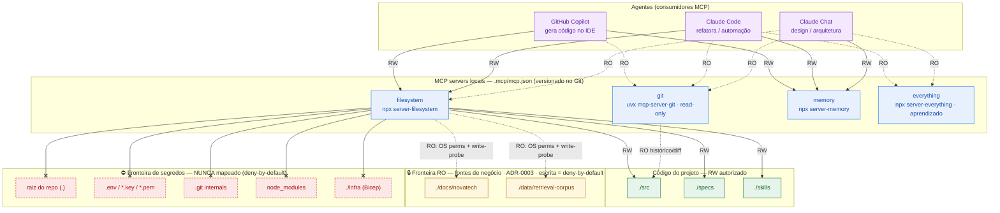

# Diagrama detalhado e Matriz de Permissões — MCP local (NovaTech Assistant)

**Projeto:** NovaTech Assistant
**Papel:** Tech Lead
**Ferramenta de autoria:** Claude (chat)
**Data:** 2026-06-15
**Escopo:** Exercício 2.2 — Prompt 2 (refinamento de [`arquitetura-mcp.md`](./arquitetura-mcp.md))

> **Princípio reitor: deny-by-default.** Nenhum escopo amplo sem justificativa explícita. `docs/novatech` e `data/retrieval-corpus` são **SEMPRE read-only**. Na dúvida, **nega**. Tudo que não está explicitamente concedido nesta matriz está negado.

---

## 1. Diagrama detalhado (Mermaid)

Mostra os 3 agentes, os 4 servers locais, o acesso por pasta (RW / RO / DENY) e duas fronteiras de segurança: a **RO das fontes de negócio** (ADR-0003) e a **zona de segredos nunca mapeada**.

**Legenda:**
- **Linha cheia `→` = RW** · **linha tracejada `⇢` = RO** · **`──x` = DENY** (negado/não mapeado).
- **`RO: OS perms + write-probe`**: o reference `server-filesystem` expõe `write_file`/`edit_file` em toda raiz; a garantia RO **não** vem da config, e sim de defesa em profundidade — permissões read-only no SO **+** write-probe no health check (ver `arquitetura-mcp.md` §4.1).
- Verde = RW autorizado · Amarelo = RO (negócio) · Vermelho tracejado = zona negada.

---

## 2. Matriz de permissões

Colunas: **Server · Primitiva exposta · Pasta/escopo · Acesso · Papel autorizado · Justificativa de least privilege · Risco se superprivilegiado.**
`DENY` = explicitamente negado (deny-by-default) — listado para tornar a fronteira auditável.

### 2.1 `filesystem`

| Server | Tool / Resource / Prompt exposto | Pasta/escopo concedido | Acesso | Papel autorizado | Justificativa de least privilege | Risco principal se superprivilegiado |
|--------|----------------------------------|------------------------|:------:|------------------|----------------------------------|--------------------------------------|
| filesystem | **Tools de leitura**: `read_file`, `read_multiple_files`, `list_directory`, `directory_tree`, `search_files`, `get_file_info` | `./src`, `./specs`, `./skills` | RW (parte leitura) | Copilot, Claude Code (RW); Claude Chat (RO) | Agente precisa ler o código/spec/skill existente para gerar saída consistente com o projeto | Se a raiz incluísse pasta com segredo, leitura vazaria credencial para o contexto/log |
| filesystem | **Tools de escrita**: `write_file`, `edit_file`, `create_directory`, `move_file` | `./src`, `./specs`, `./skills` | RW | Copilot, Claude Code | Geração/refatoração de código exige escrever exatamente nesses caminhos | Escrita em raiz ampla (`.`) permitiria alterar `infra`, `package.json` ou `.env` sem revisão |
| filesystem | Tools de leitura (mesmas acima) | `./docs/novatech`, `./data/retrieval-corpus` | **RO** | Todos os agentes | Fonte de negócio e corpus de RAG são **consultados**, nunca editados (ADR-0003) | — (acesso já é o mínimo: só leitura) |
| filesystem | Tools de escrita (`write_file`, `edit_file`, `create_directory`, `move_file`) | `./docs/novatech`, `./data/retrieval-corpus` | **DENY** | Nenhum | Negócio é imutável pelo agente; o server não bloqueia por si → enforce via OS perms + write-probe | Agente reescreve política/SLA/chunk → resposta errada com aparência oficial e fonte adulterada |
| filesystem | Qualquer tool | `./docs/adr`, `./docs/runbooks`, `./docs/onboarding.md` | **DENY** | Nenhum | Não participam do loop de geração desta fase; deny-by-default | Ampliar para `./docs` inteiro traria conteúdo desnecessário e ruído de contexto |
| filesystem | Qualquer tool | raiz `.`, `.env`/`*.key`/`*.pem`, `.git/`, `node_modules/`, `./infra` | **DENY (não mapeado)** | Nenhum | Nenhuma necessidade do agente justifica; deny-by-default | Vazamento de segredo, edição de IaC de alto impacto, ruído massivo de `node_modules` |

### 2.2 `git`

| Server | Tool / Resource / Prompt exposto | Pasta/escopo concedido | Acesso | Papel autorizado | Justificativa de least privilege | Risco principal se superprivilegiado |
|--------|----------------------------------|------------------------|:------:|------------------|----------------------------------|--------------------------------------|
| git | **Tools de leitura**: `git_status`, `git_log`, `git_diff`, `git_diff_staged`, `git_show`, `git_branch` | repositório local (`--repository .`) | **RO** | Copilot, Claude Code, Claude Chat | Contexto de "o que mudou e por quê" melhora a geração; leitura é suficiente | — (já é o mínimo) |
| git | **Tools de escrita**: `git_add`, `git_commit`, `git_create_branch`, `git_reset` | repositório local | **DENY** | Nenhum | Commit/branch é decisão humana revisada — passa pelo validation gate de PR (mesmo local) | Agente comita/branqueia sem revisão e burla o gate de PR |
| git | `--repository` apontando para outro repo | qualquer repo fora do projeto | **DENY** | Nenhum | Só o repo do projeto é relevante | Exposição de histórico/segredos de outro repositório |

### 2.3 `memory`

| Server | Tool / Resource / Prompt exposto | Pasta/escopo concedido | Acesso | Papel autorizado | Justificativa de least privilege | Risco principal se superprivilegiado |
|--------|----------------------------------|------------------------|:------:|------------------|----------------------------------|--------------------------------------|
| memory | `create_entities`, `create_relations`, `add_observations`, `read_graph`, `search_nodes`, `open_nodes` | grafo persistente do server (store próprio) | **RW** | Todos os agentes | Persistir decisões de arquitetura e linguagem ubíqua exige escrita; conteúdo é metadado de baixo risco | Grafo vira lixeira / armazena segredo ou PII de cliente NovaTech |
| memory | `delete_entities`, `delete_relations`, `delete_observations` | grafo persistente | **RW (restrito)** | Claude Code, Tech Lead | Manutenção/limpeza do grafo é ocasional e de maior impacto | Perda de histórico de decisão se qualquer agente apagar livremente |
| memory | Qualquer conteúdo sensível | grafo persistente | **DENY de conteúdo** | Nenhum | Grafo é só decisão/linguagem; segredo/PII proibido por política (§2.3 da arquitetura) | Persistência de dado sensível em store não cifrado |

### 2.4 `everything`

| Server | Tool / Resource / Prompt exposto | Pasta/escopo concedido | Acesso | Papel autorizado | Justificativa de least privilege | Risco principal se superprivilegiado |
|--------|----------------------------------|------------------------|:------:|------------------|----------------------------------|--------------------------------------|
| everything | Tools/Resources/Prompts de demonstração (`echo`, `add`, `longRunningOperation`, `sampleLLM`, prompts de exemplo) | **nenhum dado do projeto** | **RO (aprendizado)** | Claude Code, Claude Chat | Serve só para o time aprender as primitivas MCP (tools/resources/prompts) | Se receber dados do projeto, vira canal de exfiltração via tool de demo |
| everything | Qualquer acesso a pasta do projeto | `./src`, `./docs`, `./data`, etc. | **DENY** | Nenhum | Aprendizado não precisa de nada do repositório | Dado de negócio trafegando por server de demonstração |

---

## 3. Regras de leitura da matriz (prescritivas)

- **DEVE** existir uma linha explícita para cada par (server, escopo) que um agente usa. O que não está na matriz está **negado**.
- `docs/novatech` e `data/retrieval-corpus` **NÃO DEVEM** aparecer com acesso de escrita para nenhum papel — RO sempre.
- Nenhum escopo de pasta-pai (`.`, `./docs`, `./data`) **DEVE** ser concedido; só subpastas exatas com justificativa.
- Toda linha `DENY` é **auditável**: o health check (Prompts 3–4) **DEVE** falhar se um escopo negado aparecer no `.mcp/mcp.json` ou se a write-probe nas pastas RO suceder.
- Mudança nesta matriz **DEVE** ocorrer no mesmo PR que altera o `.mcp/mcp.json` (matriz = contrato; ver `arquitetura-mcp.md` §7).

---

## 4. Critérios verificáveis

- [ ] O diagrama mostra os 3 agentes, os 4 servers e o acesso **por pasta** (RW/RO/DENY).
- [ ] Há fronteira de segurança explícita em volta de `docs/novatech` + `data/retrieval-corpus` (RO) **e** em volta da zona de segredos (`.env`, `.git`, etc.).
- [ ] A matriz tem as 7 colunas exigidas e cada linha de RW/RO traz justificativa de least privilege.
- [ ] Cada linha tem o "risco se superprivilegiado" preenchido (ou "—" quando já é o mínimo).
- [ ] Existem linhas `DENY` explícitas (deny-by-default visível e auditável).
- [ ] Nenhum escopo amplo (pasta-pai) concedido sem justificativa — e nenhum foi concedido.
