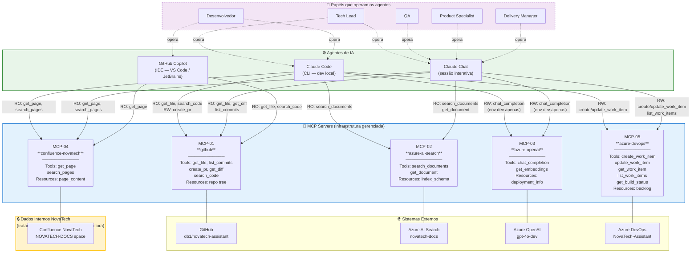

# Diagrama Detalhado e Matriz de Permissões — MCP NovaTech

> **Artefatos adicionais — Prompt 2**  
> Refinamento do documento de arquitetura MCP.  
> Regra geral aplicada: **deny-by-default** — qualquer permissão não listada aqui está negada.

---

## Artefato 1 — Diagrama Mermaid Detalhado

O diagrama abaixo mostra: agentes, servidores MCP, tipo de acesso por seta (RO / RW), e fronteiras de segurança.

### Legenda

| Estilo de seta | Significado |
|----------------|-------------|
| `RO: <tool>` | Acesso somente leitura — a tool não persiste nem modifica estado externo |
| `RW: <tool>` | Acesso de leitura e escrita — a tool modifica estado em sistema externo |
| Linha tracejada `-.->` | Relação humano → agente (operação, não chamada MCP) |
| Borda amarela | Dados classificados como internos da NovaTech — requerem DLP e auditoria adicional |

---

## Artefato 2 — Matriz de Permissões Detalhada

Regras aplicadas:
- Permissões amplas sem justificativa explícita são **negadas por padrão**.
- Em caso de incerteza entre dois escopos, o **mais restritivo** é escolhido.
- Cada linha é uma combinação server × tool/resource × papel autorizado.

| MCP Server | Tool / Resource / Prompt exposto | Papel autorizado | Escopo mínimo concedido | Justificativa de least privilege | Risco principal se superprivilegiado |
|------------|----------------------------------|-----------------|------------------------|----------------------------------|--------------------------------------|
| MCP-01 `github` | `get_file_contents` | Tech Lead, Desenvolvedor, QA, Product Specialist | `repo:read` no repositório `db1/novatech-assistant` apenas | Outros repositórios DB1 não são contexto deste projeto | Exposição de código proprietário de outros clientes DB1 ao agente |
| MCP-01 `github` | `create_pull_request` | Tech Lead, Desenvolvedor | `pull_requests:write` no repositório `db1/novatech-assistant` apenas | Apenas papéis que produzem código criam PRs; PS e DM não precisam criar PRs | Agente cria PRs em nome de papéis não-técnicos, introduzindo código não revisado |
| MCP-01 `github` | `list_commits`, `get_diff` | Tech Lead, Desenvolvedor, QA | `repo:read` (já coberto) | Leitura de histórico; sem escopo adicional necessário | — |
| MCP-01 `github` | `search_code` | Tech Lead, Desenvolvedor | `repo:read` (já coberto) | QA e PS não precisam buscar código para suas tarefas típicas | Baixo risco; negado por desnecessidade, não por ameaça |
| MCP-01 `github` | `delete_branch`, `force_push` | **Nenhum** | **NEGADO** | Ações destrutivas nunca são delegadas a agentes; requerem ação humana direta | Perda irreversível de código; bypass de branch protection |
| MCP-02 `azure-ai-search` | `search_documents` | Todos os papéis | `Search Index Reader` no índice `novatech-docs` apenas | Toda a equipe pode precisar consultar o índice para validar contexto | — |
| MCP-02 `azure-ai-search` | `get_document` | Tech Lead, Desenvolvedor, QA | `Search Index Reader` (já coberto) | PS e DM usam o Confluence para documentação de negócio; não precisam do índice bruto | PS com acesso ao índice bruto poderia vazar chunks não validados para stakeholders |
| MCP-02 `azure-ai-search` | `create_index`, `delete_index`, `upload_documents` | **Nenhum** | **NEGADO** | Gerenciamento do índice é feito pelo pipeline de ingestão (`src/pipeline/`), nunca por agente interativo | Agente reindexando com dados incorretos corromperia a base de conhecimento do assistente |
| MCP-03 `azure-openai` | `chat_completion` (deployment `gpt-4o-dev`) | Tech Lead, Desenvolvedor, QA | `Cognitive Services OpenAI User` na deployment `gpt-4o-dev` | Agentes só acessam ambiente dev; deployment de produção `gpt-4o-prod` é isolada | Consumo de quota de produção; respostas de dev vazando para usuários finais |
| MCP-03 `azure-openai` | `get_embeddings` (deployment `text-embedding-ada-002-dev`) | Desenvolvedor | `Cognitive Services OpenAI User` na deployment de embedding dev | Apenas dev precisa gerar embeddings durante implementação de `src/services/search.ts` | Custo de embedding para uso não-produtivo se concedido a todos |
| MCP-03 `azure-openai` | `chat_completion` (deployment `gpt-4o-prod`) | **Nenhum** | **NEGADO** | Produção não é acessível via agente em nenhuma circunstância | Custo descontrolado; respostas sem validação chegando a usuários reais |
| MCP-04 `confluence-novatech` | `get_page` | Todos os papéis | `space:read` no espaço `NOVATECH-DOCS` apenas | Toda a equipe precisa consultar documentação de negócio; espaços de RH e Financeiro da NovaTech não são relevantes | Agente acessando dados de RH ou contratos financeiros da NovaTech via Confluence |
| MCP-04 `confluence-novatech` | `search_pages` | Tech Lead, Desenvolvedor, Product Specialist | `space:read` (já coberto) | QA e DM tipicamente buscam páginas específicas, não precisam de busca full-text | Baixo; negado por desnecessidade |
| MCP-04 `confluence-novatech` | `create_page`, `update_page` | **Nenhum** | **NEGADO** | Confluence da NovaTech é sistema de registro do cliente; agentes não escrevem em sistemas de clientes | Documentação do cliente corrompida ou poluída com conteúdo gerado por IA sem revisão |
| MCP-05 `azure-devops` | `create_work_item` | Tech Lead, Delivery Manager | `Work Items: Write` no projeto `NovaTech-Assistant` apenas | Criação de tasks é responsabilidade de TL e DM no fluxo SDD | Dev criando work items fora do fluxo aprovado quebraria rastreabilidade das specs |
| MCP-05 `azure-devops` | `update_work_item` | Tech Lead, Desenvolvedor, Delivery Manager | `Work Items: Write` (já coberto) | Devs precisam atualizar status das tasks; QA e PS apenas leem | QA movendo tasks para "done" sem critérios validados |
| MCP-05 `azure-devops` | `get_work_item`, `list_work_items` | Todos os papéis | `Work Items: Read` no projeto `NovaTech-Assistant` | Toda a equipe precisa de visibilidade do board | — |
| MCP-05 `azure-devops` | `get_build_status` | Tech Lead, Desenvolvedor, QA | `Build: Read` no projeto `NovaTech-Assistant` | PS e DM não precisam de detalhes de build para suas tarefas | Baixo; negado por desnecessidade |
| MCP-05 `azure-devops` | `delete_work_item`, `manage_iterations`, `project_admin` | **Nenhum** | **NEGADO** | Ações administrativas e destrutivas nunca são delegadas a agentes | Perda de rastreabilidade de specs; alterações no board afetando todos os membros do time |

### Resumo de negações por princípio

| Categoria de negação | Exemplos | Razão |
|----------------------|----------|-------|
| **Ações destrutivas** | `delete_branch`, `delete_index`, `delete_work_item` | Irreversíveis; requerem decisão humana explícita |
| **Acesso a produção** | `gpt-4o-prod`, qualquer resource de prod | Isolar dev de prod é requisito absoluto |
| **Escrita em sistemas de clientes** | `create_page` no Confluence | Agentes não poluem sistemas de registro do cliente |
| **Escopos além do projeto** | outros repos GitHub, outros espaços Confluence | Contexto do agente é estritamente `db1/novatech-assistant` |
| **Por papel inadequado** | PS criando PRs, QA criando work items | Fluxo SDD define responsabilidades; agente não contorna |
